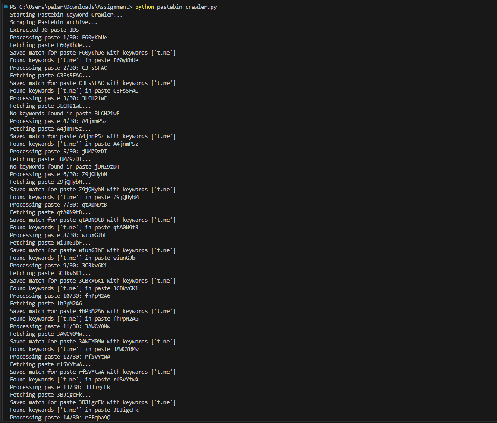

# Pastebin Keyword Crawler

A Python script to scrape Pastebin's public archive for pastes containing crypto-related keywords (e.g., "crypto", "bitcoin", "ethereum", "blockchain") or Telegram links ("t.me"). The script extracts paste IDs, fetches raw content, detects keywords, and saves matches to a JSONL file.

## Setup Instructions

1. **Clone the Repository**:
   ```bash
   git clone https://github.com/Anshul3977/pastebin-crawler.git
   cd pastebin-crawler
   ```

2. **Install Dependencies**:
   Ensure Python 3.6+ is installed. Install required libraries:
   ```bash
   pip install -r requirements.txt
   ```

   The `requirements.txt` contains:
   ```
   requests==2.31.0
   beautifulsoup4==4.12.3
   ```

3. **Run the Script**:
   Execute the script to crawl Pastebin and generate `keyword_matches.jsonl`:
   ```bash
   python pastebin_crawler.py
   ```

## Command-Line Usage

The script runs without arguments:
```bash
python pastebin_crawler.py
```

- **Output**: Creates `keyword_matches.jsonl` with JSON objects for pastes containing keywords.
- **Logs**: Generates `pastebin_crawler.log` with details of the crawling process.

## Sample Output

Example content in `keyword_matches.jsonl`:
```json
{
  "source": "pastebin",
  "context": "Found t.me in Pastebin paste ID F60yKhUe",
  "paste_id": "F60yKhUe",
  "url": "https://pastebin.com/raw/F60yKhUe",
  "discovered_at": "2025-05-15T16:37:19Z",
  "keywords_found": ["t.me"],
  "status": "pending"
}
```

## Explanation

- **Scraping**: The script scrapes `https://pastebin.com/archive` to extract up to 30 valid paste IDs (8-character alphanumeric).
- **Content Fetching**: Fetches raw paste content from `https://pastebin.com/raw/{paste_id}`.
- **Keyword Detection**: Checks for keywords (`crypto`, `bitcoin`, `ethereum`, `blockchain`, `t.me`) using case-insensitive matching and regex for `t.me`.
- **Output**: Saves matches to `keyword_matches.jsonl` in the required JSON format.
- **Features**:
  - Rate-limiting with a 2-second delay between requests to avoid bans.
  - Logging to track processed pastes and errors.
  - Error handling for network issues.
  - Validation of paste IDs to exclude invalid links (e.g., `archive/javascript`).

## Proof of Concept (POC)

Below is a screenshot showing the script running and detecting the `t.me` keyword in multiple pastes:



## Validation

- **Manual Check**: Open `keyword_matches.jsonl` and verify the listed pastes contain `t.me` by visiting their URLs (e.g., `https://pastebin.com/raw/F60yKhUe`).
- **Logs**: Review `pastebin_crawler.log` to confirm which pastes were checked and any matches found.
- **Testing**: On 2025-05-15, the script found `t.me` in 27 out of 30 pastes, with results saved correctly.

## Notes

- The script filters paste IDs using regex to ensure only valid 8-character IDs are processed, fixing issues with category links.
- If no keywords are found, `keyword_matches.jsonl` may be empty, which is expected.
- Ensure an active internet connection, as the script relies on HTTP requests.
